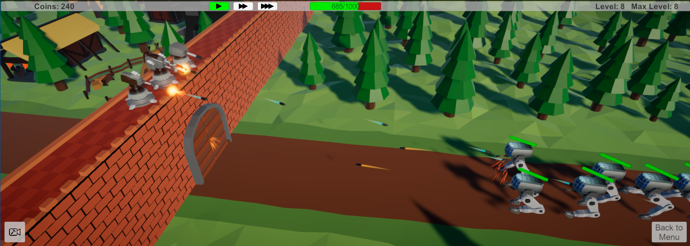
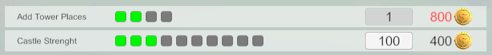

  

<h1 align="center">Castle Defense</h1>

## Description
A simple tower defense game created during learning Unity. Nothing special - you just build towers, upgrade them, and trying to kill as many enemies as possible.

## Main Points
* I'm trying to make everything easy scaling and independent!
* Towers and enemies based on single class - Spawnable, and used ScriptableObjects for Initialization. So it's very easy to add new units.
* Using Events and Singleton instances to communicate between classes
* UpgradesSystem based on ScriptableObjects - create new ScriptableObject and Upgrade already in menu! You just need to add listener to UpgradeEvent where you need.

* Most of the 3D models created by myself
* Basic animation and VFX was also made :collision::sparkles:
